# Diabetes Readmission Prediction Project

## Overview
We have been assigned a new project from the Director of Clinical Informatics to use the diabetes dataset provided to determine the leading variables of readmission so the hospital can take corrective action to reduce the 30-day readmission rate. Our team will clean the dataset and visualize the work done in building the diabetes readmission predictive model. We will also design the infrastructure components necessary to build, test and deploy an algorithm to predict the likelihood of 30-day readmissions in the diabetic population.

### Three Components
1. Python Analytics (HHA550)- Data cleaning and predictive modeling in Python
2. Data Visualization (HHA 552) - Visualization of key clinical insights using Tableau
3. Infrastructure Design (HHA 551) - Deployment architecture using AWS for real-time clinical integration

## Dataset
Source: UCI Machine Learning Repository
Link: https://archive.ics.uci.edu/ml/datasets/Diabetes+130-US+hospitals+for+years+1999-2008 

## Repo Structure
```
diabetes_readmission_project/
│
├── data/
│   ├── diabetic_data.csv
│   └── cleaned_diabetic_data.csv
│
├── src/
│   ├── data_cleaning.py
│   ├── analysis.py
│   └── run_all.py
│
├── images/
│   ├── anova_results.csv
│   ├── cluster_summary.csv
│   ├── clusters_scatter.png
│   ├── confusion_matrix.png
│   ├── correlation_heatmap.png
│   ├── decision_tree_importance.png
│   ├── final_selected_predictors.png
│   ├── model_accuracy_comparison.png
│   ├── model_evaluation_metrics.csv
│   ├── model_evaluation_metrics.png
│   ├── random_forest_importance.png
│   ├── readmission_by_inpatient_visits.png
│   ├── readmission_by_medications.png
│   ├── top_linear_predictors.png
│   ├── top_logistics_predictors.png
│
├── tableau_visualization/     
│   ├── healthcare_utilization_age.png
│   ├── prior_inpatient_visits.png
│   ├── outpatient_visits.png
│   ├── combined_utilization_heatmap.png
│   ├── clinical_complexity_scatter.png
│   ├── insulin_age_heatmap.png
│   ├── procedures_by_age.png
│   ├── readmissions_by_gender.png
│   ├── age_diabetesMed_readmissions.png
│   ├── readmissions_by_time_in_hospital.png
│   └── aws_architecture.png
│
├── README.md
├── requirements.txt
```
## How to Run the Project

1. Clone the repository
2. Install dependencies
    `pip install -r requirements.txt`
3. Run the analysis pipeline
    `python src/run_all.py`
4. Outputs will be generated in the `/images` folder
5. Tableau visualizations can be viewed in `/tableau_visualization`

## Repository Contents

- `/src`: Python scripts for data cleaning and modeling  
- `/data`: Raw and cleaned datasets  
- `/images`: Model outputs and analysis visuals  
- `/tableau_visualization`: Tableau dashboards and charts  

## Team Members
- Anita Liu
- Angel Huang 
- Huma Babar
- Aarav Desai
- Tanveer Kaur 

# Part 1: Python Analytics (HHA 550)

## Objective 
Identify the fewest variables required to predict 30-day readmission using statistical and machine learning methods.

## ETL Process
- Loaded dataset into Python
- - Replaced missing values (`"?"`) with `NaN`
- Removed invalid records (e.g., unknown gender)
- Dropped variables with >50% missing data
- Encoded categorical variables where necessary
- Created binary target variable:
    -  `<30` into 1 (readmitted within 30 days)
    -  `>30` / `NO` into 0
- Saved cleaned dataset for analysis

## Methods Used
1. Correlation Analysis
2. Linear Regression
3. Logistic Regression
4. ANOVA 
5. Clustering
6. Decision Tree
7. Random Forest

## Final Selected Predictors
The following variables were identified as the most predictive:

- `number_inpatient`
- `num_medications`
- `time_in_hospital`
- `number_diagnoses`

## Key Findings
- Patients with more prior inpatient visits are more likely to be readmitted
- Higher medication counts indicate greater treatment complexity
- Longer hospital stays reflect increased severity
- More diagnoses indicate higher comorbidity burden

## Outputs
- Correlation heatmap  
- Logistic regression feature importance  
- Linear regression coefficients  
- ANOVA statistical results  
- Clustering visualizations  
- Model performance comparison metrics

# Part 2: Data Visualization (HHA 552) 

## Objective
To translate analytical findings into clear, interpretable visual insights for clinical and executive stakeholders.

## Tableau Dashboard
An interactive Tableau dashboard was developed to allow users to explore readmission patterns dynamically across multiple dimensions including age, utilization, medication status, and clinical complexity.

Key features:
- Interactive filtering by age group and utilization level
- Drill-down capability for inpatient vs outpatient trends
- Heatmaps for identifying high-risk patient populations
- Comparative visualizations for clinical decision support

## Key Visualizations

### 1. Healthcare Utilization Increases with Age
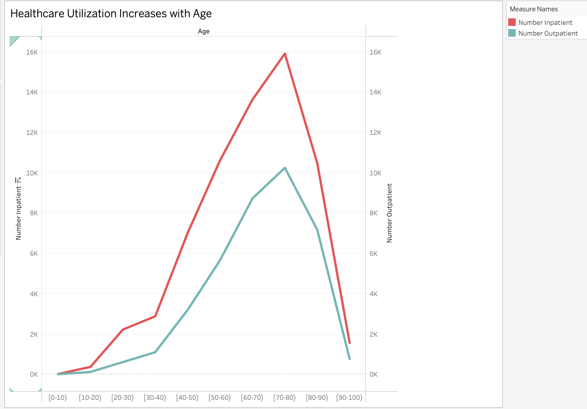
#### Key Insights
- Healthcare utilization increases significantly with age, particularly after age 40  
- Both inpatient and outpatient visits rise in parallel, indicating growing healthcare needs  
- Utilization peaks in the 70–80 age group, representing the highest demand for care  
- Inpatient visits are consistently higher than outpatient visits, suggesting more severe or complex conditions in older populations  
- After age 80, utilization begins to decline, likely due to a smaller patient population in the oldest age groups  

#### Interpretation
This trend highlights the strong relationship between aging and healthcare demand. As patients age, they require more frequent and intensive medical care, which contributes to increased system burden and higher risk of readmission.

### 2. Distribution of Readmitted Patients by Prior Inpatient Visits
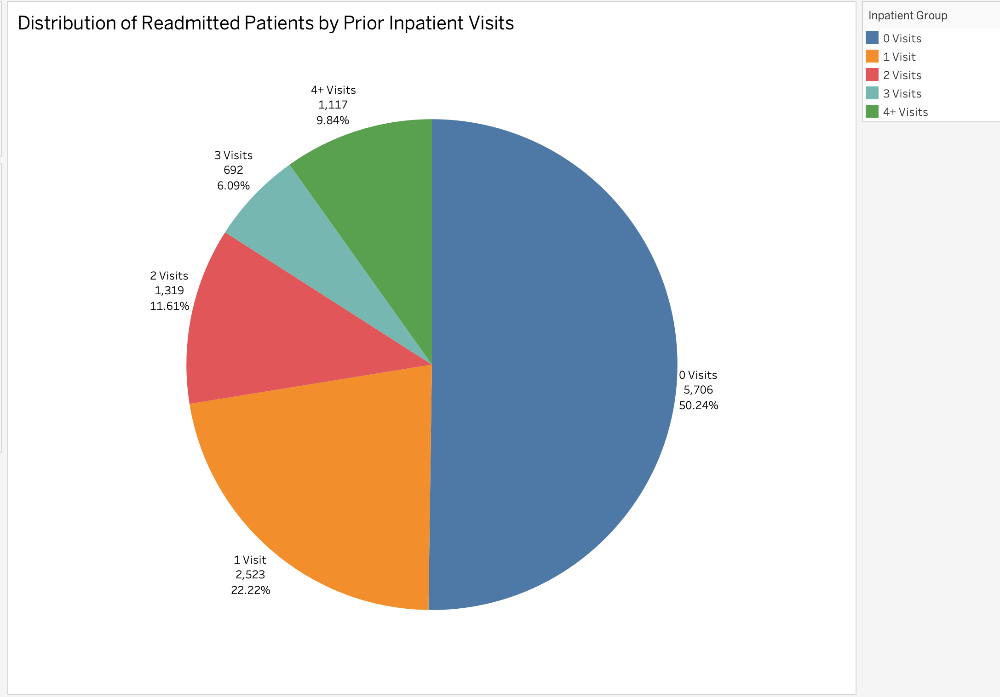
#### Key Insights
- Approximately 50% of readmitted patients had no prior inpatient visits  
- Patients with 1 prior visit account for a significant portion (~22%), indicating repeat utilization begins to increase risk  
- Readmission distribution decreases as the number of prior visits increases, but higher visit groups still represent clinically important populations  
- Patients with 2 or more prior inpatient visits collectively make up a substantial share, reinforcing the role of prior utilization as a risk factor  

#### Interpretation
While many readmitted patients had no prior inpatient visits, the likelihood of readmission increases with repeated hospital utilization. This suggests that prior inpatient history is an important predictor and can be used to identify high-risk patients for targeted interventions.

### 3. Distribution of Readmitted Patients by Outpatient Visits
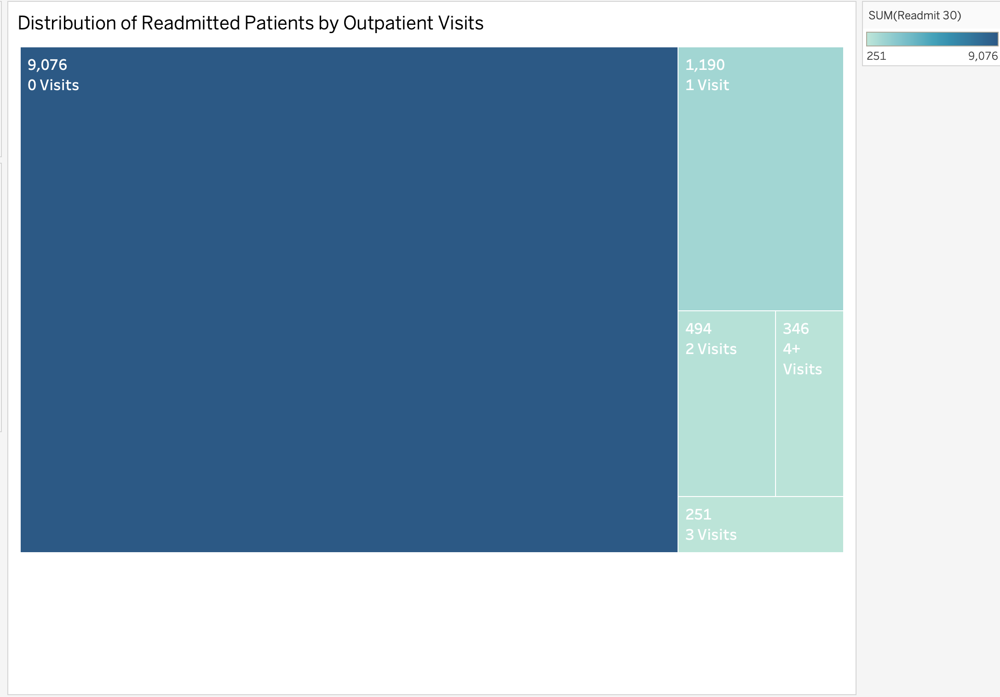
#### Key Insights
- The vast majority of readmitted patients had **0 outpatient visits (~9,076 patients)**  
- Patients with 1 outpatient visit represent a much smaller portion (~1,190)  
- Very few patients had 2, 3, or 4+ outpatient visits prior to readmission  
- There is a sharp drop-off in readmissions as outpatient visit count increases  

#### Interpretation
Low outpatient engagement is strongly associated with higher readmission counts. Patients who do not receive follow-up care or outpatient management may be at increased risk of returning to the hospital. This highlights the importance of improving outpatient follow-up and continuity of care as a strategy to reduce 30-day readmissions.

### 4. Readmission Rate by Combined Healthcare Utilization
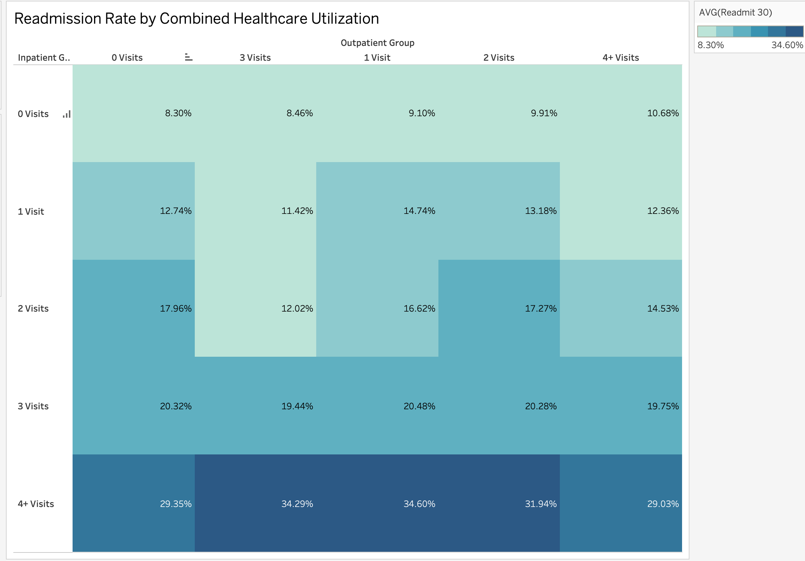
#### Key Insights
- Readmission rates increase consistently as **inpatient visits increase**
- Patients with **0 inpatient visits** have the lowest readmission rates (~8–10%)
- Patients with **4+ inpatient visits** show the highest readmission rates (~29–35%)
- Outpatient visits alone have a smaller impact compared to inpatient utilization
- The highest risk group is patients with **high inpatient AND outpatient utilization**

#### Interpretation
Prior inpatient utilization is the strongest indicator of future readmission risk. Patients with frequent hospitalizations are significantly more likely to be readmitted within 30 days. While outpatient visits contribute to risk, they do not increase readmission rates as dramatically as inpatient visits. This suggests that targeting high inpatient utilizers with intensive care coordination and follow-up interventions could have the greatest impact on reducing readmissions.

### 5. Clinical Complexity by Combined Utilization Group
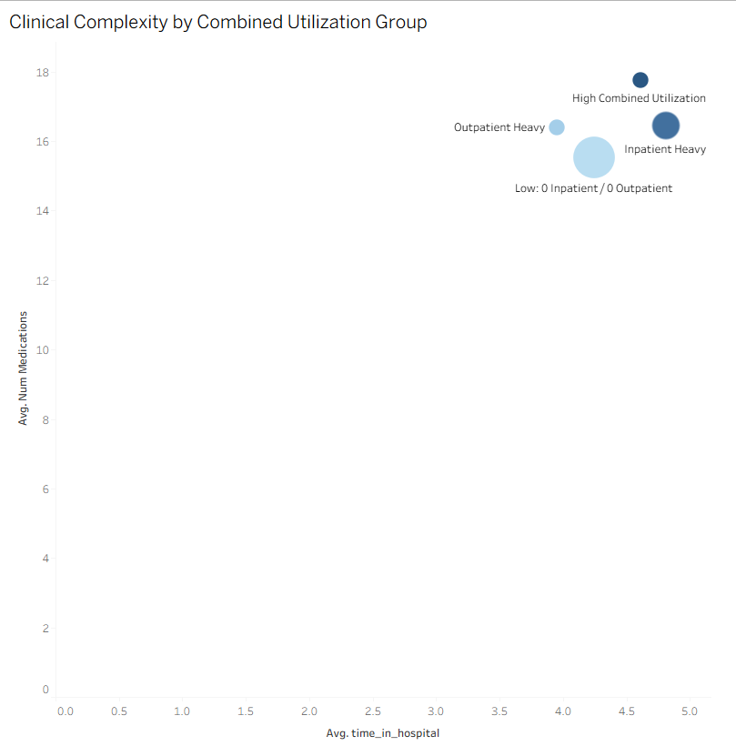
#### Key Insights
- Patients with **high combined utilization** (both inpatient and outpatient) show the highest clinical complexity  
- **Inpatient-heavy patients** have higher average time in hospital and higher medication counts  
- **Outpatient-heavy patients** have moderately high medication usage but slightly lower hospital time  
- Patients with **low utilization (0 inpatient / 0 outpatient)** have the lowest clinical complexity  
- Clinical complexity increases as both **time in hospital** and **number of medications** increase  

#### Interpretation
Clinical complexity is strongly associated with healthcare utilization patterns. Patients who frequently interact with the healthcare system—especially through inpatient care—tend to have more complex conditions, require more medications, and spend more time in the hospital. This group represents a high-risk population for readmission and may benefit from targeted care management, medication reconciliation, and coordinated follow-up strategies.

### 6. 30-Day Readmission Rate by Age Group and Insulin Status
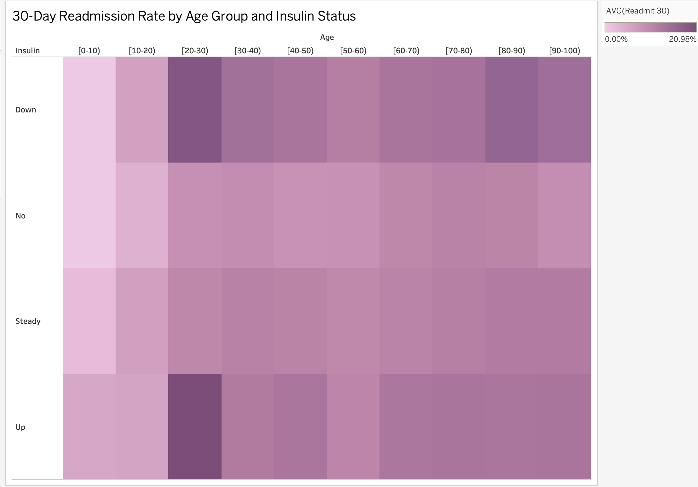
#### Key Insights
- Readmission rates generally **increase with age**, especially from 40+ age groups  
- Patients with **increasing insulin levels ("Up") show higher readmission rates**, particularly in middle-aged groups  
- Patients with **no insulin or stable insulin ("Steady") have more moderate readmission rates**  
- Younger age groups (0–30) consistently show the **lowest readmission rates** regardless of insulin status  
- The highest readmission rates are observed in **older patients with increasing insulin requirements**

#### Interpretation
Age and insulin status together provide important insight into readmission risk. Older patients, especially those requiring increased insulin management, are more likely to be readmitted within 30 days. This suggests that worsening glycemic control or disease progression may contribute to higher risk. Targeted interventions for older diabetic patients with changing insulin needs could help reduce readmission rates.

### 7. Rising Clinical Complexity by Age: Count of Procedures
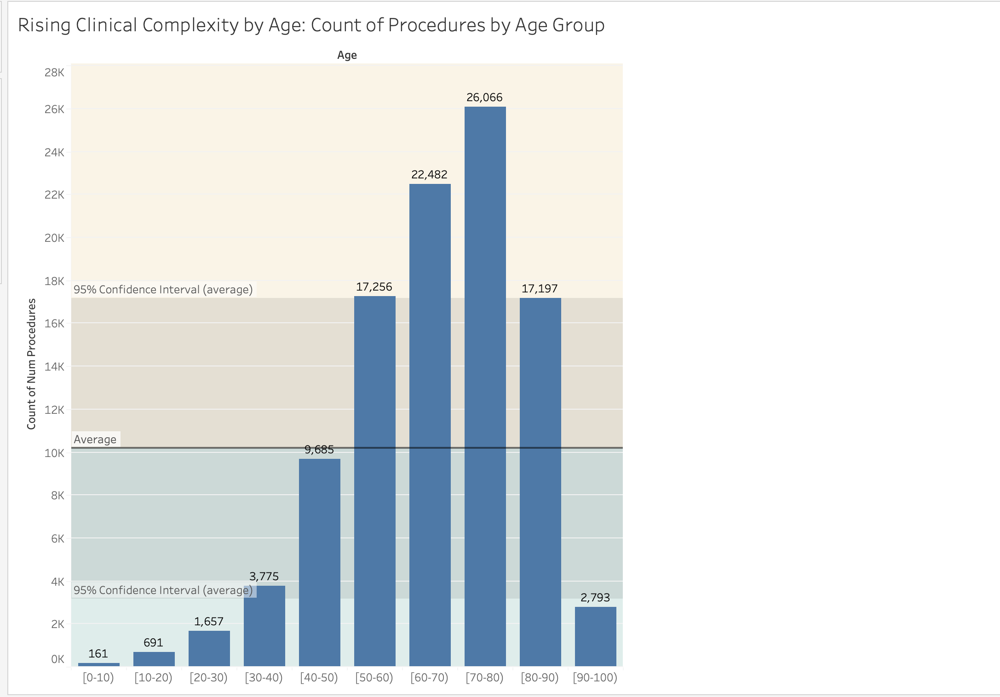
#### Key Insights
- The number of procedures **increases significantly with age**, peaking in the 70–80 age group  
- Patients aged **60–80 undergo the highest number of procedures**, far above the dataset average  
- Younger age groups (0–40) have **minimal procedure counts**, indicating lower clinical complexity  
- There is a noticeable decline after age 80, likely due to **smaller population size or survivorship effects**  
- Most older age groups exceed the **average procedure count (~9,685)**, indicating higher care intensity  

#### Interpretation
Clinical complexity rises with age, as older patients require more procedures and interventions. This increase in healthcare utilization reflects greater disease burden and comorbidities in aging populations. Since higher clinical complexity is associated with increased readmission risk, older patients—particularly those between 60 and 80—should be prioritized for proactive care management, discharge planning, and follow-up interventions.

### 8. Distribution of 30-Day Readmissions by Gender
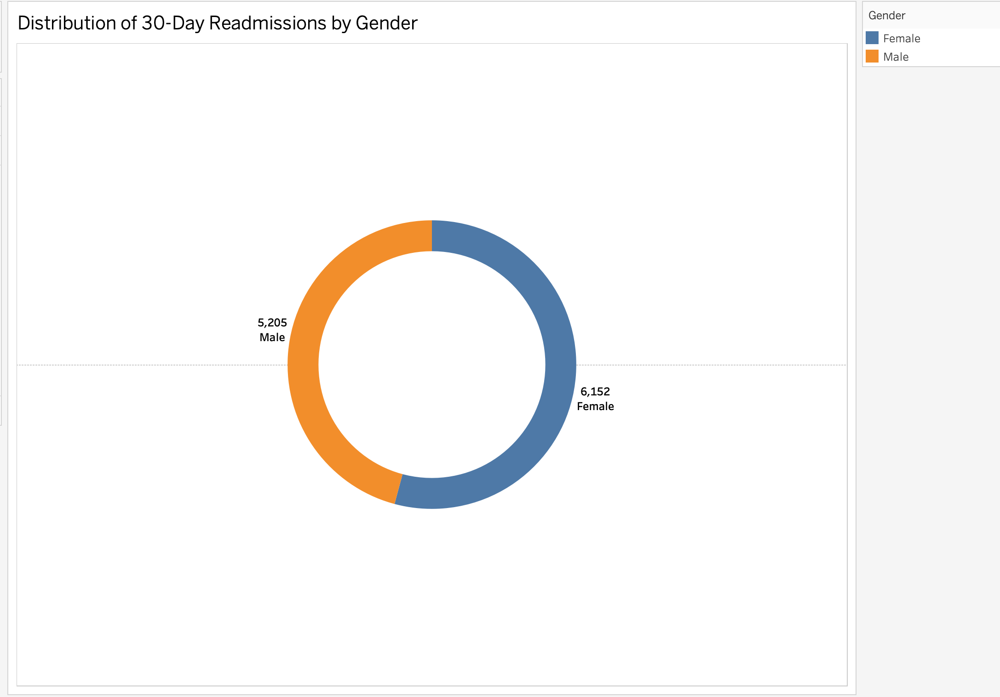
#### Key Insights
- Female patients account for a slightly higher number of readmissions (~6,152) compared to males (~5,205)  
- The distribution between genders is relatively balanced, with no extreme disparity  
- Both genders contribute significantly to overall readmission counts  

#### Interpretation
Gender does not appear to be a strong standalone predictor of 30-day readmissions in this dataset. While females show a slightly higher count of readmissions, the difference is not substantial enough to suggest a major clinical impact. This indicates that other factors—such as healthcare utilization, age, and clinical complexity—play a more significant role in predicting readmission risk.

### 9. 30-Day Readmission Counts by Age Group and Diabetes Medication Status
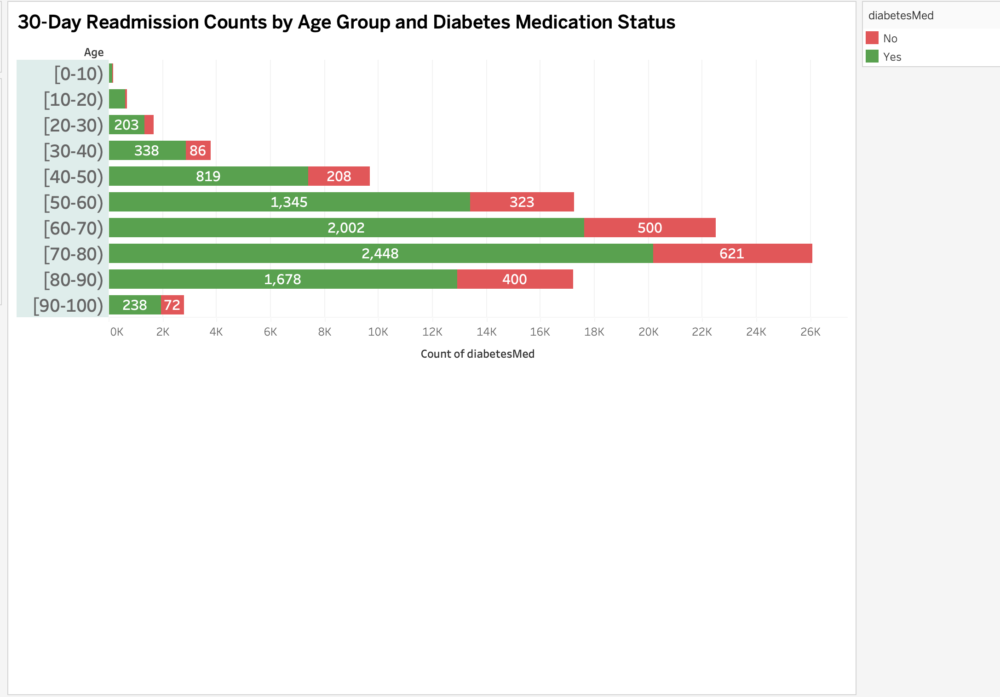
#### Key Insights
- Readmission counts increase significantly with **age**, peaking in the 70–80 age group  
- Patients on **diabetes medication ("Yes") account for the majority of readmissions** across all age groups  
- The gap between medication vs. no medication widens in older populations  
- Younger age groups (0–30) show very low readmission counts regardless of medication status  
- Readmissions begin to rise sharply starting around the **40–50 age group**

#### Interpretation
Age and diabetes medication status together highlight patterns in disease burden and care needs. Patients on diabetes medication—especially older adults—experience higher readmission counts, likely reflecting more advanced or actively managed disease. This suggests that older diabetic patients receiving medication represent a high-risk group and may benefit from closer monitoring, medication management, and post-discharge follow-up to reduce readmissions.

### 10. Number of 30-Day Readmissions by Time in Hospital
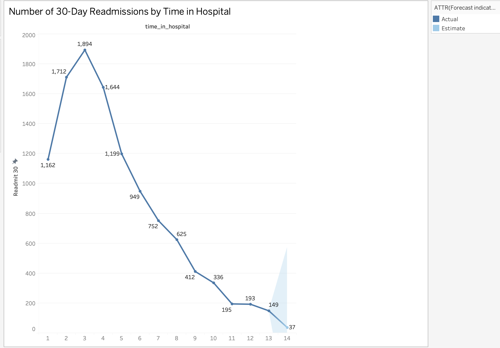
#### Key Insights
- Readmissions peak around **2–4 days of hospital stay**, with the highest at ~3 days (~1,894 cases)  
- After 4 days, readmissions begin to **decline steadily as length of stay increases**  
- Very short stays (1–2 days) still show relatively high readmission counts  
- Extended hospital stays (10+ days) are associated with **much lower readmission counts**  
- There is a sharp drop-off in readmissions after approximately **7–8 days of hospitalization**

#### Interpretation
Patients with shorter hospital stays are more likely to be readmitted within 30 days, which may indicate premature discharge or insufficient stabilization before leaving the hospital. Longer hospital stays, while more resource-intensive, may allow for more comprehensive treatment and discharge planning, reducing the likelihood of readmission. This suggests that optimizing length of stay—ensuring patients are clinically ready for discharge—could play a critical role in reducing readmission rates.

## Clinical & Operational Impact

The visual analysis provides actionable insights for healthcare systems aiming to reduce 30-day readmissions:

- **Early Risk Identification**
  - Patients with high prior inpatient utilization can be flagged at admission
- **Improved Discharge Planning**
  - Patients with short hospital stays may require additional evaluation before discharge
- **Targeted Follow-Up Care**
  - Low outpatient utilization patients should be prioritized for post-discharge outreach
- **Resource Optimization**
  - High-risk populations (older adults, high utilization groups) can receive focused care coordination
- **Chronic Disease Management**
  - Diabetic patients with increasing insulin needs represent a key intervention group

These insights support data-driven decision-making for both clinical teams and hospital administrators.

## Limitations
- The dataset contains missing values and may not fully represent all patient populations
- Multiple encounters per patient may introduce bias in utilization patterns
- Some variables (e.g., A1C, glucose levels) were excluded due to high missingness
- Readmission is treated as binary and does not capture severity or cause
- External factors (social determinants of health, access to care) are not included

Future work could incorporate additional clinical and socioeconomic variables to improve predictive insights.

## Key Takeaways
- Healthcare utilization is the **strongest driver of readmission risk**
- Readmission rates increase significantly with **prior inpatient visits**
- **Older patients (60–80)** represent the highest-risk population
- Low outpatient engagement is associated with **higher readmission counts**
- Clinical complexity (medications, procedures, LOS) strongly correlates with readmissions
- Short hospital stays may contribute to **premature discharge risk**

Overall, readmissions are driven by a combination of **utilization patterns, age, and clinical complexity**, rather than a single factor.

# Part 3: Infrastructure Design (HHA 551)

## Objective
To design a scalable, secure, and cloud-based infrastructure for building, deploying, and integrating a 30-day readmission prediction model into a clinical workflow.

## Architecture Overview
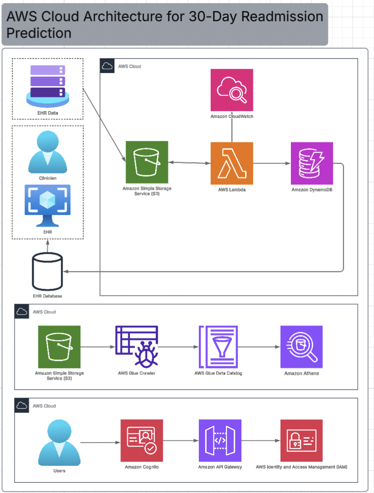

This architecture enables real-time and batch processing of Electronic Health Record (EHR) data to support predictive analytics and clinical decision-making.

## Core Components

### 1. Data Ingestion & Storage
- **EHR Systems / Database**
  - Source of patient clinical data
  - Includes demographics, visits, medications, and diagnoses

- **Amazon S3**
  - Central storage for raw and processed data
  - Acts as the data lake for analytics and model input

### 2. Data Processing & Analytics Pipeline
- **AWS Glue Crawler**
  - Automatically scans and identifies data schema in S3

- **AWS Glue Data Catalog**
  - Stores metadata for structured querying

- **Amazon Athena**
  - Enables SQL-based querying of large datasets directly from S3
  - Used for exploratory data analysis and reporting

### 3. Model Processing & Prediction Layer
- **AWS Lambda**
  - Serverless compute for running prediction logic
  - Processes incoming patient data in real-time
  - Calls trained readmission prediction model

- **Amazon DynamoDB**
  - Stores prediction results (risk scores)
  - Enables fast retrieval for clinical systems

- **Amazon CloudWatch**
  - Monitors system performance and logs
  - Tracks errors, latency, and system health

### 4. API & Application Layer
- **Amazon API Gateway**
  - Exposes prediction model as a secure API
  - Allows EHR systems to request readmission risk scores

- **Amazon Cognito**
  - Handles user authentication and access control
  - Ensures only authorized clinicians access the system

- **AWS IAM (Identity and Access Management)**
  - Manages permissions and security policies
  - Enforces least-privilege access across services

### 5. End Users
- **Clinicians**
  - Access predictions through EHR interface
  - Use risk scores for clinical decision-making

## Data Flow

1. Patient data is generated in the EHR system  
2. Data is stored in **Amazon S3**  
3. **AWS Glue** catalogs and prepares the data  
4. **Amazon Athena** enables querying and analysis  
5. New patient data triggers **AWS Lambda**  
6. Lambda runs the prediction model  
7. Results are stored in **DynamoDB**  
8. Clinicians access predictions via **API Gateway**  
9. Security is enforced through **Cognito and IAM**  
10. System performance is monitored using **CloudWatch**


## Key Features

### Scalability
- Serverless architecture (Lambda, S3) automatically scales with demand  
- Supports large volumes of patient data without infrastructure management  

### Security & Compliance
- IAM enforces role-based access control  
- Cognito provides secure authentication  
- Data encryption can be applied at rest (S3, DynamoDB) and in transit  

### Real-Time Decision Support
- Lambda + API Gateway enables near real-time predictions  
- Clinicians receive immediate risk insights during patient care  

### Cost Efficiency
- Pay-as-you-go model with serverless components  
- No need for maintaining physical servers  

## Clinical Workflow Integration

- Predictions are integrated into the **EHR interface**
- Clinicians can:
  - View readmission risk scores at discharge
  - Identify high-risk patients early
  - Trigger interventions (follow-ups, care coordination)

## Impact

This architecture supports:
- Early identification of high-risk patients  
- Improved discharge planning  
- Reduced hospital readmissions  
- Data-driven clinical decision-making  

By combining cloud scalability with real-time analytics, this system enables healthcare organizations to proactively manage patient outcomes.


## Future Improvements

- Integrate **Amazon SageMaker** for advanced model training and deployment  
- Incorporate **real-time streaming (Kinesis)** for continuous data ingestion  
- Add **dashboarding tools (QuickSight)** for executive reporting  
- Expand to include **social determinants of health data**  

## Conclusion
This project demonstrates that 30-day readmissions can be effectively analyzed and predicted using a combination of statistical modeling, data visualization, and cloud-based infrastructure. Key drivers such as healthcare utilization, age, and clinical complexity consistently influence readmission risk. By integrating these insights into a scalable AWS architecture, healthcare systems can transition from reactive care to proactive intervention.